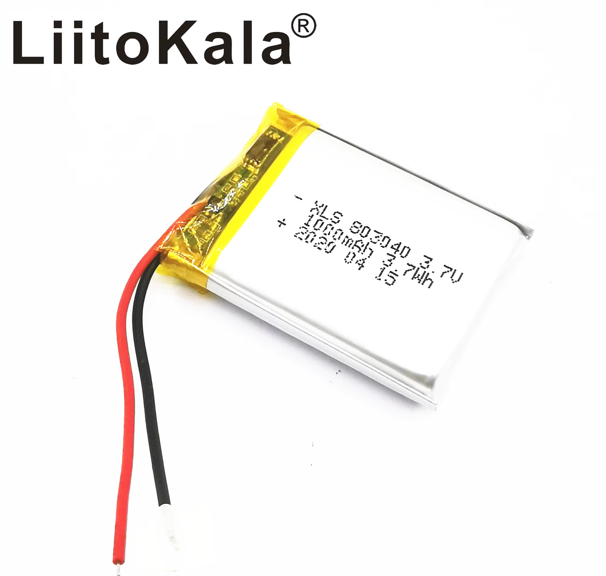
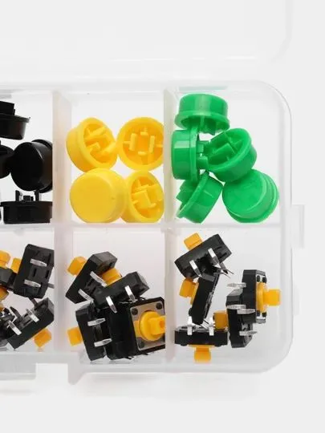
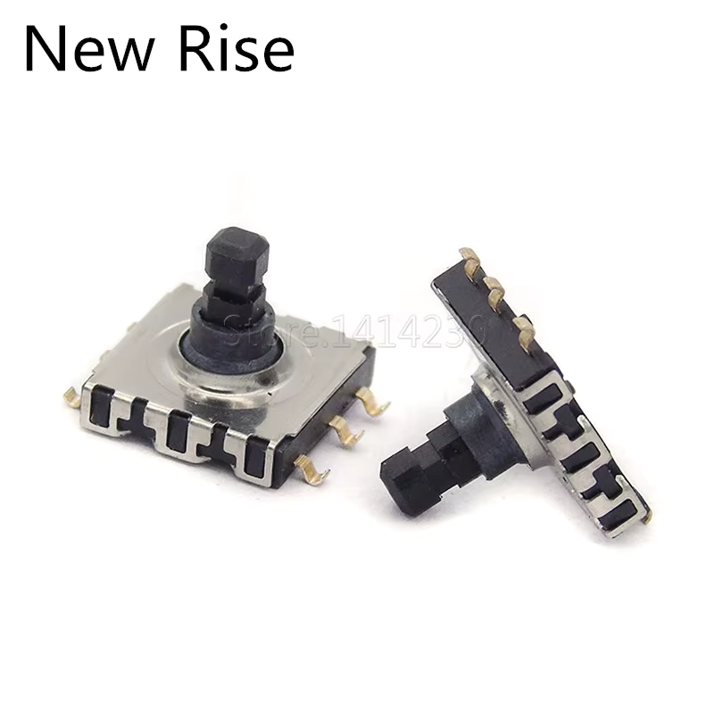
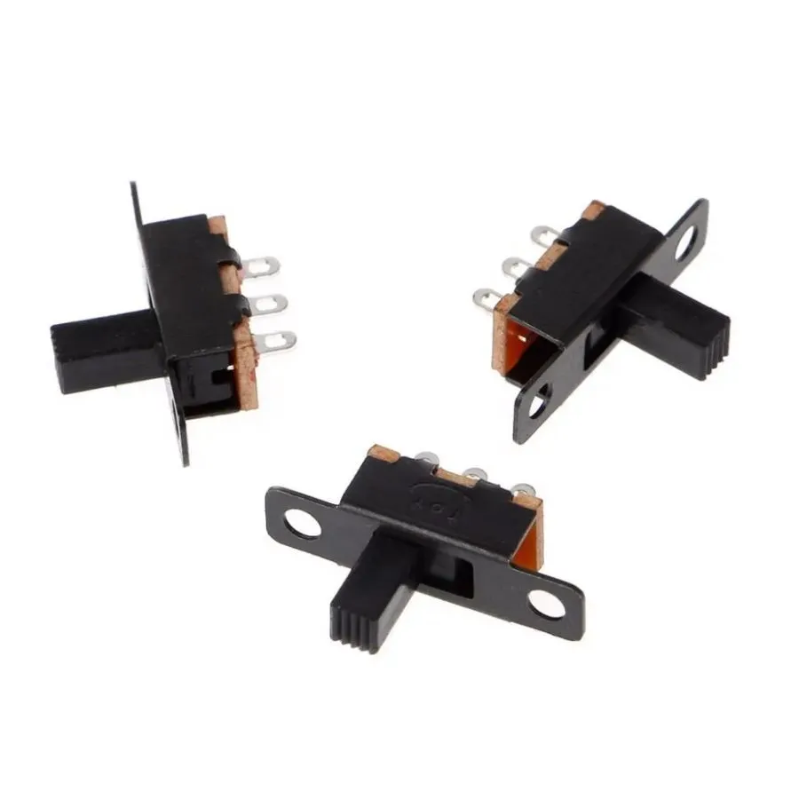
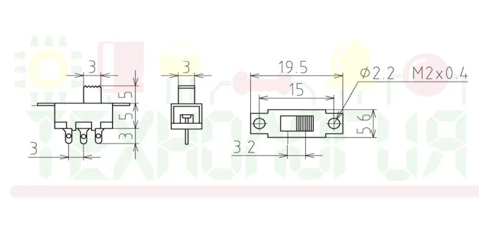

Для изготовления печатной платы я использовал CNC 3018 MAX, полностью металлическую версию.

`Версия KiCad 9.0.0-9.0.0-2 ubuntu 24`

На основной плате видно, что мы используем ESP32-WROOM-32 с 520кб ОЗУ и 4мб FLASH.

К ней подключен по SPI ST7789V 240x320, шлейфом 18 пин, 5-ти позиционной кнопке и четырем обычным кнопкам.
Для получения дисплея как в нашем проекте нужно снять с красной платы дисплей для этого.
Будьте осторожны, шлейф очень хрупкий. Лучше работать феном и медленно, без большой нагрузки отодвигать шлейф со своего посадочного места для дальнейшего закрепления на нашей печатной плате.

Для сборки понадобится:
 - Текстолит односторонний больше чем 130x60мм
 - ESP32-WROOM-32 4мб flash, 520 КБ ОЗУ без PSRAM
 - TP4056
 - Аккумулятор 1000мач, 3.7В https://aliexpress.ru/item/4000939317595.html?sku_id=10000011329056470&spm=a2g2w.productlist.search_results.0.2c3a1aecBi4K3i

 - Тактовые кнопки, 4 шт. Размер: 12*12*7,3 мм

 - Пяти позиционная кнопка https://aliexpress.ru/item/1005008348341984.html?sku_id=12000044686793517&spm=a2g2w.productlist.search_results.5.2bd063f3eioFhZ

 - Переключатель питания https://www.ozon.ru/product/vyklyuchatel-dvizhkovyy-polzunkovyy-pereklyuchatel-10-sht-1323063165/?from=share_android&perehod=smm_share_button_productpage_link

